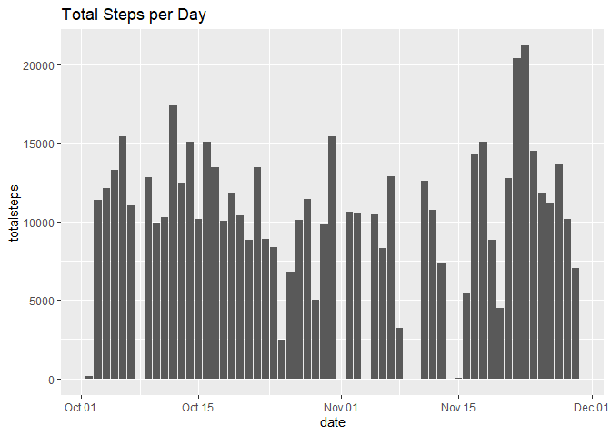

## Loading and preprocessing the data

The following code will load the zip file and transform the data into my preferred format. Also, the DPLYR and LUBRIDATE packages will be loaded. The output will be a sample of the original data.


```r
library(dplyr)
```

```
## 
## Attaching package: 'dplyr'
```

```
## The following objects are masked from 'package:stats':
## 
##     filter, lag
```

```
## The following objects are masked from 'package:base':
## 
##     intersect, setdiff, setequal, union
```

```r
library(lubridate)
```

```
## 
## Attaching package: 'lubridate'
```

```
## The following objects are masked from 'package:base':
## 
##     date, intersect, setdiff, union
```

```r
act1 <- as_tibble(read.csv(unzip("activity.zip")))
act1$date <- as_date(act1$date)
head(act1)
```

```
## # A tibble: 6 x 3
##   steps date       interval
##   <int> <date>        <int>
## 1    NA 2012-10-01        0
## 2    NA 2012-10-01        5
## 3    NA 2012-10-01       10
## 4    NA 2012-10-01       15
## 5    NA 2012-10-01       20
## 6    NA 2012-10-01       25
```

## What is mean total number of steps taken per day?

The following sets of code will answer how many steps are taken per day. I end up creating a table which combines the mean, median, and total steps per day. A sample is provided.


```r
act2 <- na.omit(act1)
meansteps2 <- tapply(act2$steps, act2$date, FUN = mean)
mediansteps2 <- tapply(act2$steps, act2$date, FUN = median)
totalsteps2 <- tapply(act2$steps, act2$date, FUN = sum)
dates2 <- names(meansteps2)
summarysteps2 <- bind_cols(dates2, meansteps2, mediansteps2, totalsteps2)
```

```
## New names:
## * NA -> ...1
## * NA -> ...2
## * NA -> ...3
## * NA -> ...4
```

```r
names(summarysteps2) <- c("date", "meansteps", "mediansteps", "totalsteps")
summarysteps2$date <- as_date(summarysteps2$date)
head(summarysteps2)
```

```
## # A tibble: 6 x 4
##   date       meansteps mediansteps totalsteps
##   <date>         <dbl>       <dbl>      <int>
## 1 2012-10-02     0.438           0        126
## 2 2012-10-03    39.4             0      11352
## 3 2012-10-04    42.1             0      12116
## 4 2012-10-05    46.2             0      13294
## 5 2012-10-06    53.5             0      15420
## 6 2012-10-07    38.2             0      11015
```

```r
mean(summarysteps2$totalsteps, na.rm = TRUE)
```

```
## [1] 10766.19
```

```r
median(summarysteps2$totalsteps, na.rm = TRUE)
```

```
## [1] 10765
```

The mean is above is 10766.19 and the median is 10765.

Below is a plot of the table.


```r
library(ggplot2)
ggplot(data = summarysteps2, mapping = aes(date, totalsteps)) + geom_col() + ggtitle("Total Steps per Day")
```

<!-- -->

It appears the spike in steps to above 20,000 shows the users really like to shop during the Thanksgiving holiday, motivating more steps than on a normal day!!

## What is the average daily activity pattern?

For this question, a new table is created to group the steps by the 5-minute intervals. The final output will be the largest number of mean steps and its interval number.


```r
meanint <- tapply(act2$steps, act2$interval, FUN = mean)
intervals <- names(meanint)
summaryints <- bind_cols(intervals, meanint)
```

```
## New names:
## * NA -> ...1
## * NA -> ...2
```

```r
names(summaryints) <- c("interval", "meansteps")
summaryints$interval <- as.numeric(summaryints$interval)
filter(summaryints, meansteps == max(meansteps))
```

```
## # A tibble: 1 x 2
##   interval meansteps
##      <dbl>     <dbl>
## 1      835      206.
```

The most average steps are taken at interval 835, which translates to 8:35 - 8:40am. Maybe people are busy trying to get to work before 9!

Below is a graph showing the average steps per 5-minute interval.


```r
plot(summaryints$interval, summaryints$meansteps, type = "l", 
     main = "Average Steps per 5-Minute Interval", 
     xlab = "Interval", ylab = "Steps")
```

<!-- -->

## Imputing missing values

How many missing values are in the original dataset?


```r
sum(is.na(act1))
```

```
## [1] 2304
```

The following script will impute the missing values using the meansteps variable calculated for the 5-minute intervals. If the value is missing, meansteps will become the new value, and if the there is an original value, the original value will remain. A new table is created, with a sample provided below.


```r
act3 <- left_join(act1, summaryints, by = 'interval')
act3$steps <- as.double(act3$steps)
for(i in 1:length(act3$steps)) {
  if(is.na(act3[i,1]) == "TRUE") {
    act3[i,1] <- act3[i,4]
  }
}
meansteps3 <- tapply(act3$steps, act3$date, FUN = mean)
mediansteps3 <- tapply(act3$steps, act3$date, FUN = median)
totalsteps3 <- tapply(act3$steps, act3$date, FUN = sum)
dates3 <- names(meansteps3)
summarysteps3 <- bind_cols(dates3, meansteps3, mediansteps3, totalsteps3)
```

```
## New names:
## * NA -> ...1
## * NA -> ...2
## * NA -> ...3
## * NA -> ...4
```

```r
names(summarysteps3) <- c("date", "meansteps", "mediansteps", "totalsteps")
summarysteps3$date <- as_date(summarysteps3$date)
head(summarysteps3)
```

```
## # A tibble: 6 x 4
##   date       meansteps mediansteps totalsteps
##   <date>         <dbl>       <dbl>      <dbl>
## 1 2012-10-01    37.4          34.1     10766.
## 2 2012-10-02     0.438         0         126 
## 3 2012-10-03    39.4           0       11352 
## 4 2012-10-04    42.1           0       12116 
## 5 2012-10-05    46.2           0       13294 
## 6 2012-10-06    53.5           0       15420
```

```r
mean(summarysteps3$totalsteps, na.rm = TRUE)
```

```
## [1] 10766.19
```

```r
median(summarysteps3$totalsteps, na.rm = TRUE)
```

```
## [1] 10766.19
```

A new plot for the imputed data is provided below.


```r
library(ggplot2)
ggplot(data = summarysteps3, mapping = aes(date, totalsteps)) + geom_col() + ggtitle("Total Steps per Day (Imputed)")
```

<!-- -->

Does the imputed data and graph vary from the original results which ignored the missing data? 


```r
mean(summarysteps2$totalsteps, na.rm = TRUE) - mean(summarysteps3$totalsteps, na.rm = TRUE)
```

```
## [1] 0
```

```r
median(summarysteps2$totalsteps, na.rm = TRUE) - median(summarysteps3$totalsteps, na.rm = TRUE)
```

```
## [1] -1.188679
```

The mean values did not change, which makes given the imputed values were using means. There was a slight change of -1.19 with the median using the imputed values.

## Are there differences in activity patterns between weekdays and weekends?

The following script will create a new table using the imputed data, this time organized to show if the data occurred on a weekend or a weekday. A sample is provided.


```r
act3 <- act3 %>% mutate(dayofweek = as.factor(wday(date)))
weekday <- act3 %>% filter(dayofweek == "2" | dayofweek == "3"
    | dayofweek == "4" | dayofweek == "5" | dayofweek == "6") %>%
    mutate(daytype = "weekday") %>%
  select(daytype, interval, steps)
weekend <- act3 %>% filter(dayofweek == "1" | dayofweek == "7") %>%
  mutate(daytype = "weekend") %>%
  select(daytype, interval, steps)
act4 <- bind_rows(weekday, weekend)
head(act4)
```

```
## # A tibble: 6 x 3
##   daytype interval  steps
##   <chr>      <dbl>  <dbl>
## 1 weekday        0 1.72  
## 2 weekday        5 0.340 
## 3 weekday       10 0.132 
## 4 weekday       15 0.151 
## 5 weekday       20 0.0755
## 6 weekday       25 2.09
```

The following is a plot showing the steps per 5-minute interval on weekdays and weekends.


```r
act4 %>% ggplot(aes(x=interval, y=steps)) +
  geom_line() + facet_wrap(facets = "daytype", dir = "v") +
  ggtitle("Steps per 5-Minute Interval")
```

<!-- -->

There are some differences in the steps taken per interval. The most noticeable is that activity starts later in the day and also ends slightly earlier. It seems people may rest more on the weekend, with a slight surge in the late afternoon when people are getting ready for evening social activities.
